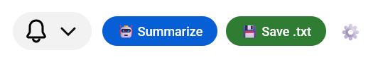

# 📺 YouTube Transcript Assistant (AI Summary & Export)

A lightweight, privacy-focused Greasemonkey/Tampermonkey userscript that extracts YouTube transcripts directly from your browser session. It allows you to save timestamped transcripts as `.txt` files or send them to an LLM (via OpenRouter/OpenAI) for an instant, beautifully formatted HTML summary directly on the page.

  

## ✨ Features

- **Bot-Detection Proof:** Uses your actual browser session to fetch transcripts, avoiding the IP bans common with CLI tools and scrapers.
- **AI Summarization:** Sends cleaned transcripts to your choice of LLM (GPT-4, Claude, Gemini, etc.) via OpenRouter or any OpenAI-compatible API.
- **In-Page UI:** Displays summaries in a native-looking, toggleable, and copyable box above the video description.
- **Clean Export:** Download timestamped transcripts as `.txt` files with sanitized filenames based on the video title.
- **Customizable:** Configure your API URL, Key, and Model name directly via a settings gear in the UI.
- **Dark Mode Ready:** UI elements use YouTube's native CSS variables to match your theme.

## 🚀 Installation

1. Install a userscript manager like **Greasemonkey** (Firefox) or **Tampermonkey** (Chrome/Edge).
2. Create a new script in your manager.
3. Copy the code from `youtube-transcript-helper.user.js` and paste it in.
4. Save the script and refresh any YouTube video page.

## ⚙️ Configuration

Once installed, a new set of buttons will appear near the "Subscribe" button on YouTube:

1. Click the **Settings (⚙️)** icon.
2. Enter your **API URL** (e.g., `https://openrouter.ai/api/v1/chat/completions`).
3. Enter your **API Key**.
4. Enter the **Model ID** (e.g., `stepfun/step-3.5-flash:free` or `nvidia/nemotron-3-super-120b-a12b:free`).

## 🛠️ Technical Details

- **Language:** JavaScript (ES6+)
- **Permissions:** Uses `GM.xmlHttpRequest` for cross-origin API calls and `GM.setValue/GetValue` for secure local storage of API keys.
- **Compatibility:** Optimized for the 2026 YouTube "View Model" UI update.

## 📝 License

Distributed under the MIT License. See `LICENSE` for more information.
